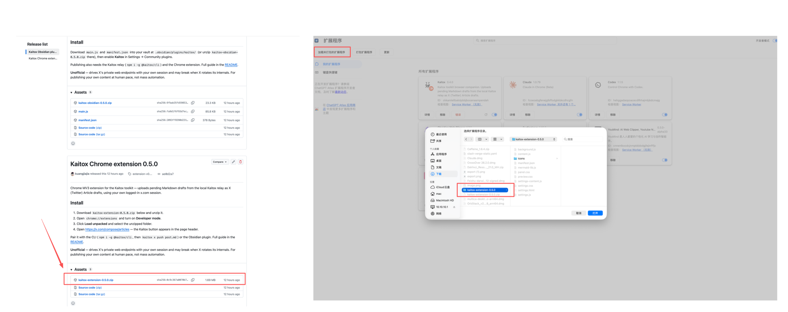
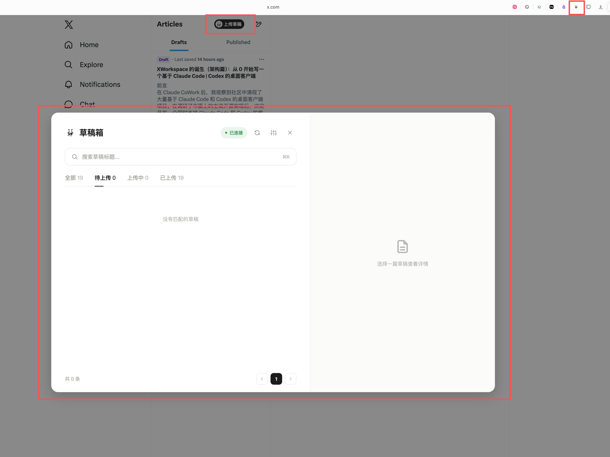
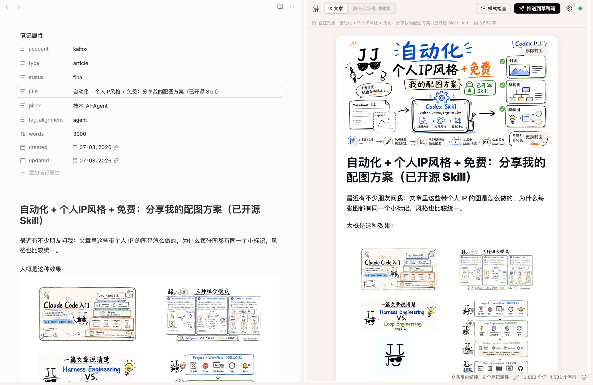
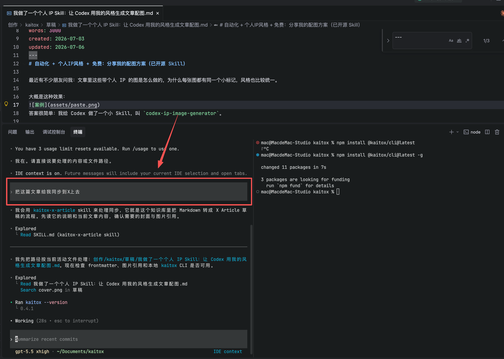
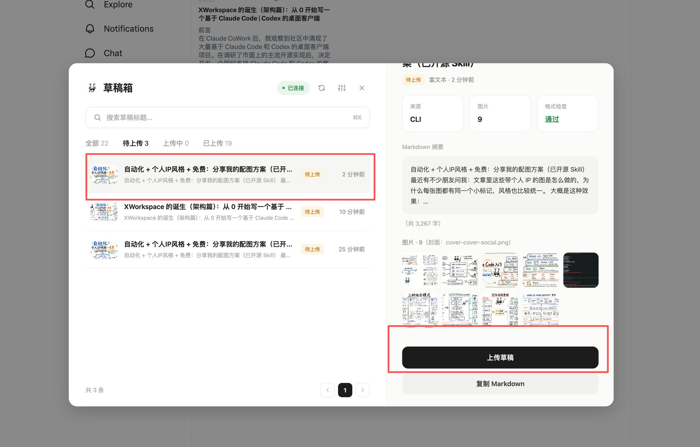

[English](x-article.md) | 简体中文

# X Article 发布

把本地 Markdown 发成 X (Twitter) Article 草稿——图片、排版、封面一次到位。这是 [Kaitox](../../README.zh-CN.md) 上的第一个功能。

最省事的用法：装上 agent skill，然后直接让你的 coding agent（Claude Code / Codex）同步一个 Markdown 文件——它替你把全流程跑完。

## 工作方式

1. **推送** — agent（经 Kaitox skill）、Obsidian 插件、CLI 或你自己的脚本对 Markdown 做风格检查，连同图片字节打包，投递到 `127.0.0.1` 上的本地 relay。
2. **中转** — relay 只监听回环地址，把待办草稿存在本地磁盘。数据不出你的机器。
3. **上传** — Chrome 插件在 X 草稿页取走草稿，用你自己已登录的会话创建 Article 草稿。

不走官方 API、不需要 API key：插件驱动的是你浏览器里已登录 x.com 会话的网页端接口，正常的浏览器登录态就是全部所需。

想知道哪些 Markdown 元素能过转换这一关？看 [Markdown → X 文章格式支持一览](x-article-markdown-mapping.zh-CN.md)。

## 使用入口

| 入口 | 做什么 | 详情 |
|---|---|---|
| **Agent skill** | 教会 Claude Code / Codex（及兼容 agent）替你跑完整个发布流程——推荐用法 | [`skills/`](../../skills/README.zh-CN.md) |
| **Chrome 插件** | 在 X 草稿页用你自己的会话上传待办草稿 | [`apps/extension`](../../apps/extension/README.zh-CN.md) |
| **Obsidian 插件** | 把当前笔记一键同步为草稿：wikilink、图片、`cover:` frontmatter（仅桌面端） | [`apps/obsidian`](../../apps/obsidian/README.zh-CN.md) |
| **CLI** | 在终端里对 Markdown 做风格检查、打包并投递到 relay | [`packages/cli`](../../packages/cli/README.zh-CN.md) |

## 安装

**环境要求：** Node.js ≥ 18、一个你保持登录的 X 账号，上传那一步还需要 Chrome（或任意 Chromium 内核浏览器）。

两块东西：一个推送草稿的 agent **skill**，和一个上传草稿的 **Chrome 插件**（真正把内容写进 X 的浏览器那一半，无可替代）。

### 1. 安装 agent skill

用 Claude Code、Codex 或兼容的 agent 驱动 Kaitox，只需装上 [`kaitox-x-article`](../../skills/README.zh-CN.md) [skill](../../skills/README.zh-CN.md)——从本仓库的 checkout 里复制：

```bash
# Claude Code —— 一个 skill 目录，靠 description 自动触发
cp -r skills/kaitox-x-article ~/.claude/skills/                        # 或按项目放 .claude/skills/

# Codex —— 一个用 /kaitox-x-article 调用的 prompt
cp skills/kaitox-x-article/SKILL.md ~/.codex/prompts/kaitox-x-article.md
```

推送端就这一步：skill 会在 `kaitox` CLI 缺失时**自动帮你装上**（`npm i -g @kaitox/cli`，装不了则退回 `npx`），并**自动拉起本地 relay**。其它 agent 宿主见 [`skills/README.zh-CN.md`](../../skills/README.zh-CN.md)。

> 想不借助 agent、自己在终端里跑？用 `npm i -g @kaitox/cli` 装上 CLI——命令与参数说明、以及 relay 管理都在 [CLI README](../../packages/cli/README.zh-CN.md) 里。

> **注意：** Chrome 插件和 Obsidian 插件正在 Chrome 应用商店和 Obsidian 社区插件目录审核中。审核通过前，请按下面的步骤手动安装。

### 2. 安装 Chrome 插件

到 Releases 页下载：

<https://github.com/kuangjiajia/kaitox-toolkit/releases>

打开 **Kaitox Chrome extension** 那个 release，下载 `kaitox-extension-<版本>.zip` 解压，然后打开 `chrome://extensions`，开启**开发者模式**，点**加载已解压的扩展程序**，选解压出来的文件夹。



在登录状态下打开 <https://x.com/compose/articles> —— relay 在跑时，页面角落会出现 Kaitox 面板。



（可选）[Obsidian 插件](../../apps/obsidian/README.zh-CN.md)可直接从 vault 推送草稿：到同一个 [Releases 页](https://github.com/kuangjiajia/kaitox-toolkit/releases)，打开 **Kaitox Obsidian plugin** 那个 release，把它的 `main.js` 和 `manifest.json` 放进 `.obsidian/plugins/kaitox/`，在设置里启用。装好后，在笔记旁打开 X 文章面板，就能预览渲染后的草稿、做样式检查，并推送到 X 草稿箱。



## 使用

两步：让你的 agent 同步 Markdown，然后在浏览器里上传。

### 1. 让 agent 同步 Markdown

装好 skill 后，直接告诉 agent 你要发什么，比如：

> 把 `./post.md` 同步成 X Article 草稿。

agent 会对文件做风格检查，用大白话讲清任何 X-friendly 问题，并让你选怎么处理——去修改、降级为纯文本，还是原样上传——然后把草稿投递到你的本地 relay。CLI 没装、relay 没起时它会自己搞定，你根本不用碰终端。你也可以在同一句话里让它带上封面图或覆盖标题。



### 2. 在浏览器里上传

打开 <https://x.com/compose/articles>，在 Kaitox 面板里找到你的草稿，点**上传草稿**。插件会用你自己已登录的会话上传图片、创建 Article 草稿，然后跳进编辑器。图片和排版一次到位——满意后在 X 里自行发布。



更想自己在终端里跑？完整的 `kaitox x push` 参考——参数、frontmatter、图片解析规则，以及 `list` / `status`——都在 [CLI README](../../packages/cli/README.zh-CN.md) 里。

## 边界

发布走的是 X 的私有网页接口加你自己的登录态：非官方用法，X 调整内部实现时随时可能失效，仅用于以人类节奏发布你自己的内容——不要批量自动化。各入口的具体限制见对应 README。
